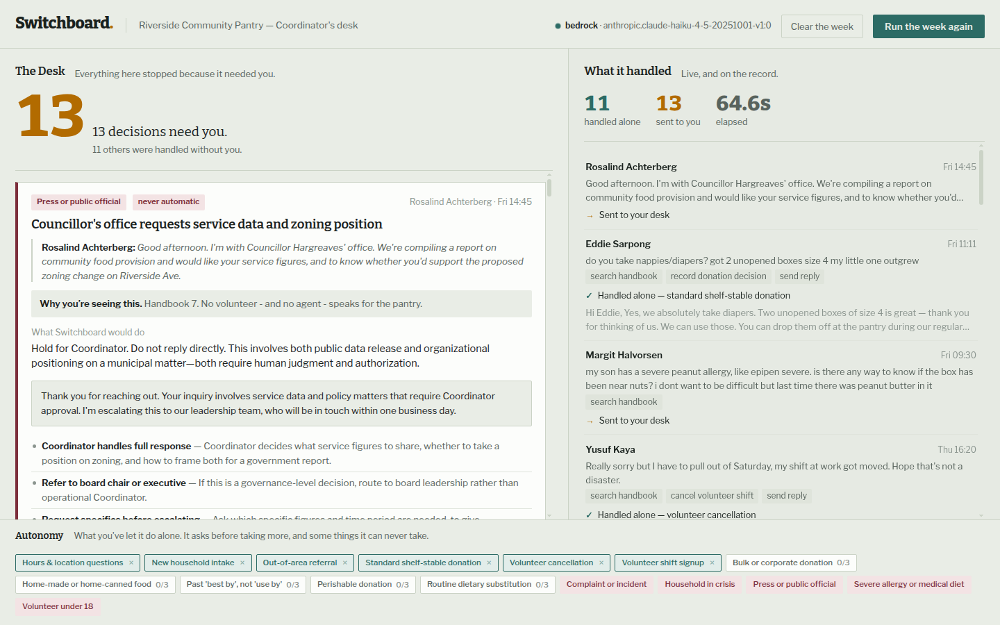

# Switchboard

**An operations agent that runs a small food pantry's inbox — and earns the right to act alone, one decision class at a time.**

Built for the [Agents for Humans Hackathon](https://agentsforhumans.devpost.com) with the
**Strands Agents SDK** on **Amazon Bedrock**.



---

## The problem

Riverside Community Pantry feeds about 400 households a week. It is run by one paid
Coordinator and a rota of volunteers. That Coordinator's real job is not deciding what
food to hand out — it is answering the inbox. Roughly 150 messages a week:

> *"are you open saturday"* · *"can I sign up for the sort shift"* · *"my mum makes
> amazing chutney, shes got about 40 jars to donate"* · *"i dont know if this is the
> right number. we ran out of food yesterday and the baby finished the last formula
> this morning"*

Most of those messages have an answer already written down in the volunteer handbook.
A handful do not, and those are the ones that matter. The Coordinator burns their week
on the first kind and gets to the second kind tired.

The obvious fix — "put an AI on the inbox" — is the wrong fix, and small nonprofits know
it. The failure mode isn't a wrong answer about opening hours. It's an agent that
cheerfully accepts 40 jars of home-canned jam (illegal under state health code), or
sends a chirpy auto-reply to a mother who just ran out of infant formula, or talks to a
15-year-old about volunteering. The cost of those mistakes is not measured in tokens.

## What Switchboard does

Switchboard reads the whole week's inbox. For each message it:

1. **Triages** it into one of 16 decision classes, judging by *substance, not tone*.
2. Checks that class against the **Autonomy Dial** — a live, human-owned trust setting.
3. If the class is **AUTO**, it acts: searches the handbook, books the shift, registers
   the household, records the donation, sends the reply. It writes what it did to a ledger.
4. If the class is **ASK** or **NEVER**, it stops. It does the research anyway and hands
   the Coordinator a **Decision Desk card**: what was asked, why it stopped, what it
   recommends, two or three real options, a drafted reply, and the handbook clauses it
   relied on — quoted, so you can check its work.

The screen has exactly two halves. The left is **The Desk**: only what needs a human.
The right is **What it handled**: everything it did without one, live, as it happens.

The goal state of the product is an empty left panel.

## The idea that makes it different: the Autonomy Dial

Most agent demos have one switch: on, or off. Switchboard has a dial with three
positions per decision class, and the agent moves along it by earning trust.

| Tier | Meaning |
|---|---|
| **AUTO** | The agent acts alone and tells you afterwards. |
| **ASK** | The agent researches and recommends, then stops. A human decides. |
| **NEVER** | The agent will never act alone here, no matter how well it performs. |

An **ASK** class becomes **AUTO** only when the Coordinator has approved the agent's
recommendation **three times without changing a word**. At that point the agent asks for
the promotion in its own words:

> *You've approved my last 3 "Routine dietary substitution" recommendations without
> changing a word. Want me to start handling these myself?*

Two rules make this honest rather than decorative:

- **Editing resets the counter to zero.** Not pauses it — resets it. If you had to fix
  the agent's answer, it had not learned the thing yet.
- **NEVER is a ceiling, not a default.** Five classes are permanently non-promotable no
  matter how many approvals accumulate: a **minor asking to volunteer**, a **severe or
  anaphylactic allergy**, a **household in crisis**, a **complaint or incident**, and
  **press or a public official**. These are the situations where a human being is the
  point. The agent cannot be talked into them, and neither can a hand-edited policy file —
  the loader re-clamps any persisted tier back under its ceiling on startup.

This is the part we would defend hardest. Autonomy in a real nonprofit is not a
capability you ship; it is a relationship you build, incrementally, with a ceiling.

## The guardrail is a real control, not a prompt

`AutonomyGuard` is a Strands `HookProvider` on `BeforeToolCallEvent`. Every write tool —
booking, cancelling, registering, referring, recording, substituting, replying — passes
through it. If the message's decision class is not currently AUTO, the guard calls
`event.cancel_tool(...)` and the tool never executes. It also fails closed: if no class
was established at all, every write is cancelled.

The model is never trusted to police itself. Ask it nicely to send the reply anyway and
the tool call is still cancelled, at the SDK layer, before any state changes.

`scripts/test_guard.py` proves this with a live model: it hands the agent a NEVER-class
message and asserts the write was blocked, then flips the same class to AUTO and asserts
the identical request now goes through. **19 assertions, all passing.**

---

## Architecture

```
                         ┌──────────────────────────────┐
  inbox message  ──────► │  TRIAGE          (Haiku 4.5)  │
                         │  read-only: search_handbook   │
                         │  emits strict JSON:           │
                         │  {decision_class, urgency,    │
                         │   summary, signals[]}         │
                         └───────────────┬───────────────┘
                                         │
                            ┌────────────┴────────────┐
             POLICY.may_act_alone(class)?              │
                            │                          │
                  ── yes (AUTO) ──            ── no (ASK / NEVER) ──
                            │                          │
                            ▼                          ▼
          ┌─────────────────────────────┐  ┌──────────────────────────────┐
          │ RESOLVER        (Haiku 4.5) │  │ ESCALATOR       (Haiku 4.5)  │
          │ full toolset, writes state  │  │ read-only. Builds the        │
          │                             │  │ Decision Desk card:          │
          │  every tool call ▼          │  │  headline · why it stopped · │
          │  ┌───────────────────────┐  │  │  recommendation · options ·  │
          │  │   AutonomyGuard       │  │  │  draft reply · citations     │
          │  │   BeforeToolCallEvent │  │  └───────────────┬──────────────┘
          │  │   cancel_tool() if    │  │                  │
          │  │   class is not AUTO   │  │                  ▼
          │  └───────────────────────┘  │       ┌──────────────────────┐
          └──────────────┬──────────────┘       │   THE DESK           │
                         │                      │   human approves /   │
                         ▼                      │   edits / declines   │
               ┌──────────────────┐             └──────────┬───────────┘
               │  LEDGER          │                        │
               │  what it did,    │        3 clean approvals│
               │  on the record   │                        ▼
               └──────────────────┘             ┌──────────────────────┐
                                                │  AUTONOMY DIAL       │
                                                │  ASK ──► AUTO        │
                                                │  (NEVER never moves) │
                                                └──────────────────────┘

  Every node/tool/guard event ──► EventBus ──► SSE /api/stream ──► live browser trace
```

**Orchestration** is a Strands `GraphBuilder` graph with conditional edges. The edge
condition is also the only place in the run where the decision class first exists, so it
does double duty: it parses triage's JSON, validates the class against the known set, and
publishes it where the tools and the guard can both see it before the next node starts.

**Concurrency.** The week runs 24 messages through the graph with an `asyncio.Semaphore`
of 4, so the trace fills the screen the way a real Monday morning does rather than
trickling one message at a time. A full week completes in about **60 seconds**.

### Files

| Path | What it is |
|---|---|
| `switchboard/agents.py` | The three agents, their prompts, the graph, and `AutonomyGuard` |
| `switchboard/policy.py` | The Autonomy Dial: tiers, promotion, the NEVER ceiling |
| `switchboard/tools.py` | 8 Strands `@tool` functions and the per-message context plumbing |
| `switchboard/runtime.py` | Week runner, trace collector, Decision Desk card construction |
| `switchboard/org.py` | Pantry state (shifts, households, donations, ledger) + handbook search |
| `switchboard/handbook.md` | The pantry's real policy corpus — the agent's source of truth |
| `switchboard/scenario.py` | 24 inbound messages, with ground-truth labels for evaluation only |
| `switchboard/server.py` | FastAPI + SSE |
| `web/` | The console. Vanilla JS/CSS, no build step. |

### Why the handbook search is lexical, not a vector store

A vector index would look better on a slide. It would be worse here. The entire promise
of the Decision Desk is that a Coordinator can read the quoted clause and check the
agent's work in four seconds. Lexical retrieval over headed sections returns the section
the Coordinator already knows by number — `§4.2 Items we never accept` — and returns the
same section every time for the same question. Auditability beat recall, so we chose it
deliberately. The tradeoff is written into the code where the decision lives.

---

## Running it

### Requirements

- Python 3.11+
- Amazon Bedrock access to `us.anthropic.claude-haiku-4-5-20251001-v1:0` in `us-east-1`
  (or an `ANTHROPIC_API_KEY`)

### Setup

```bash
python3 -m venv .venv
.venv/bin/pip install -r requirements.txt
```

### Credentials

Switchboard uses whatever is already in your environment. Any one of these works:

```bash
export AWS_BEARER_TOKEN_BEDROCK=...          # a Bedrock API key
# or
export AWS_ACCESS_KEY_ID=...  AWS_SECRET_ACCESS_KEY=...
# or, to skip Bedrock entirely
export ANTHROPIC_API_KEY=...
```

A Bedrock API key does *not* populate the normal boto3 credential chain, so
`config.py` checks for it explicitly before falling back to `Session.get_credentials()`.

### Start

```bash
./run.sh                 # http://127.0.0.1:8000
PORT=9000 ./run.sh
```

Open the page and press **Run the week**.

### Tests

```bash
.venv/bin/python scripts/test_guard.py   # 19 assertions: policy + live guard enforcement
.venv/bin/python scripts/smoke.py        # end-to-end over a 6-message slice
```

`test_guard.py` covers the offline policy invariants (unknown classes fail closed to ASK;
a hand-edited policy file cannot promote a NEVER class; an edit resets the approval
counter) and then runs the live model twice to prove the guard actually cancels a write.

---

## What we would do next

- **Real inbox adapters.** The scenario file is a stand-in for a Gmail/Twilio intake.
  Nothing above the adapter changes.
- **Per-organization handbooks.** The handbook is a markdown file; onboarding a second
  pantry is a file, not a fine-tune.
- **Shared dials.** A pantry network could publish a recommended starting dial —
  including the NEVER floor — so a new org inherits five years of someone else's hard
  lessons on day one.

## License

MIT — see [LICENSE](LICENSE).
